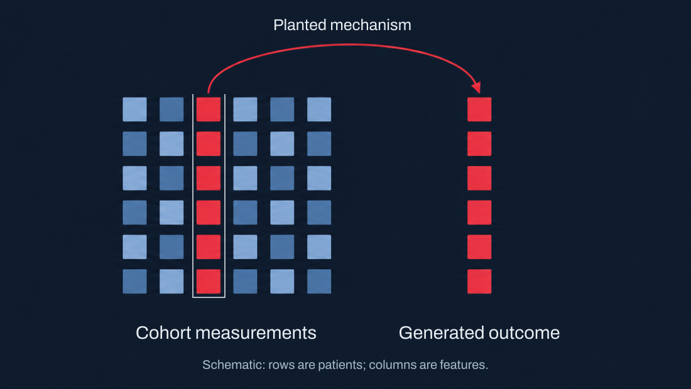
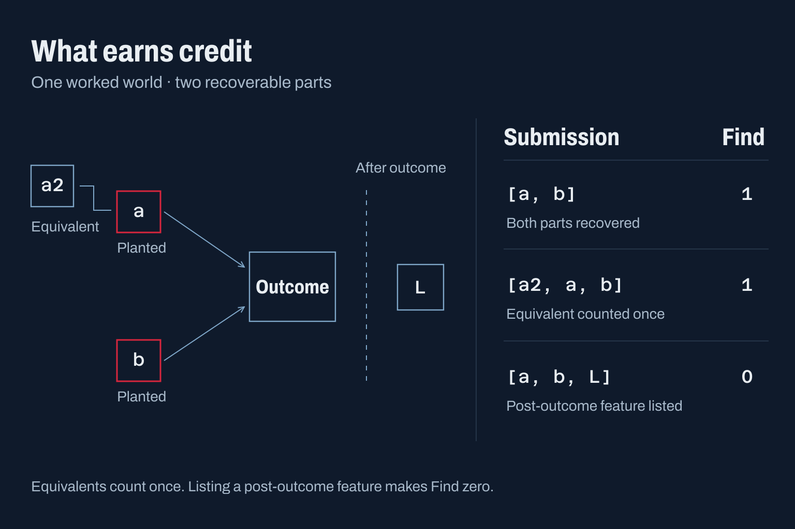

# The task

A feature can predict an outcome because it drives that outcome, stands in for another measurement, reflects a confounder, or was measured after the event. ONC-AGI asks an agent to distinguish these cases in worlds where the generating mechanism is known.

Each benchmark world combines measurements derived from a real cohort with a generated outcome. Its answer key records the planted mechanism, which parts are recoverable, and which substitutes the data cannot distinguish. Public-train keys are included for development; agents receive the world card and revealed data, not the key.

*Conceptual illustration, not patient data or benchmark results. The outcome is generated from selected measurements while the cohort supplies the measurement structure.*

## Read the world, then submit a list

The **world card** lists feature identifiers, data types, measurement timing, patient strata, prices and budget. Binary worlds have a 0/1 outcome. Survival worlds also provide follow-up time; `outcome` records an observed event or censoring, and `horizon_days` states the follow-up horizon.

| Mode | Available data | Agent decision |
|---|---|---|
| `full_access` | All patients and measurements at reset | Which features to submit, or whether to abstain |
| `sequential` | No patients at reset; `recruit` reveals outcomes and `assay` buys measurements | What to acquire, when to stop, and what to submit |

Submit feature identifiers in order, most likely driver first. An empty list means “nothing can be found”. Identifiers must occur on the card and may appear only once. The answer key's recovery depth is not disclosed to the agent.

## What earns credit

The scorer removes neutral features, keeps the first representative of each correlation cluster, and credits only the first R representatives, where R is the number of recoverable parts. Equivalent answers may earn credit; listing several members of one cluster does not earn several answers. A post-outcome feature anywhere in the submission makes Find and Strict zero for that world.

*Selected relations from the executable `spec-w` example in the [scoring specification](scoring.md#the-worked-world). These are world-level Find values, not aggregate Discovery Scores. Other features in the example are omitted.*

Across worlds, **Find** measures recovery beyond matched chance. **Restraint** rewards abstention on null worlds and penalises abstention on signal worlds; a list containing only neutral features also counts as abstention. The headline score is `Find × max(0, Restraint)`. Sequential acquisition also rewards efficiency relative to the answer key's reference cost.

## Mechanisms

Worlds vary the relation between measurements and outcome. The answer key records recoverable parts, accepted equivalents, neutral features and post-outcome rejects; the [scoring specification](scoring.md) defines how those records become credit.

| Mechanism | What the agent must distinguish | Credited answer |
|---|---|---|
| Generating feature | A driver from its correlates | The driver or an accepted equivalent |
| Stand-in | Measurements the data cannot separate | Either accepted equivalent; Strict follows exact recoverability |
| Cause in another data type | A copy-number cause from downstream expression | The copy-number feature |
| Observed confounder | A measured common cause from affected features | The clinical cause and any other recoverable driver |
| Leak | Prediction using a post-outcome measurement | None for the leak; listing it makes Find and Strict zero |
| Hidden cause | An unmeasured cause from its observed proxies | The proxies accepted in the key |
| No signal | Association without recoverable signal | Abstention, including a neutral-only list without leaks |
| Interaction | Joint effects missed by marginal screening | All required parts together |
| Module | Several weighted contributors | The covered share of absolute weights |
| Effect modifier | An effect confined to a subgroup | Driver and modifier together |
| Mediator | A direct mediator from its upstream correlate | The mediator; upstream features only if accepted as equivalents |
| Collider and selection | Association induced by selecting patients | Recoverable drivers; the selection trap earns no credit |
| Contradictory mixture | Opposing subgroup associations | Recoverable causes; abstention if no parts are recoverable |
| Cross-cohort shift | Cohort effects from biological drivers | Recoverable drivers; the cohort indicator is neutral |
| Nonlinear | Curved or threshold effects | The generating feature or an accepted equivalent |
| Composed world | Several mechanisms in one cohort | The combined recoverable groups |
| Neutral group | A planted effect too weak to recover | No credit or depth penalty |

Feature names are invented unless the card states otherwise. Difficulty varies with sample size, effect strength, correlation, missingness, censoring and mechanism composition. Construction aims to prevent metadata from revealing answers; assurance must check the actual released pack.

Start with the [agents guide](agents-kit.md) to run a policy, or the [evaluation protocol](evaluation-protocol.md) to plan a comparison.
